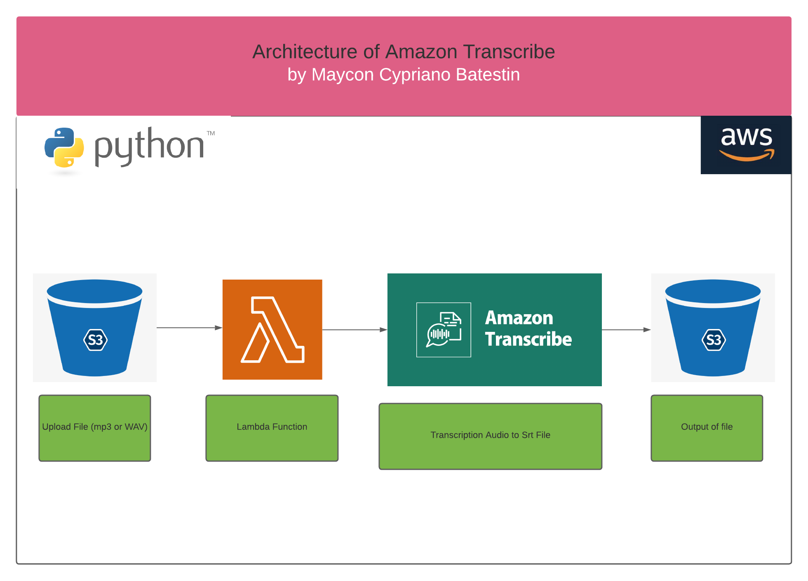

<h1 align="center">

<h3> 
AMAZON TRANSCRIBE  
 </h3>
<h3> 
 ================= 
 </h3>

>> Arquitetura da solução:

>> <h3> Description </h3>
-------------------------

 
Amazon Transcribe uses a deep learning process called automatic speech recognition (ASR) to convert speech to text quickly and accurately. Amazon Transcribe can be used to transcribe customer service calls, to automate closed captioning and subtitling, and to generate metadata for media assets to create a fully searchable archive.
In this project we use a very simple architecture. We use Lambda to perform the operation, this lambda is triggered by any file to be inserted into S3. Once inserted, it will play and transcribe the audio file to another output bucket.
